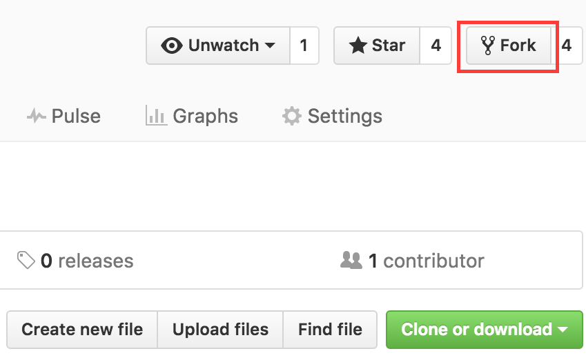
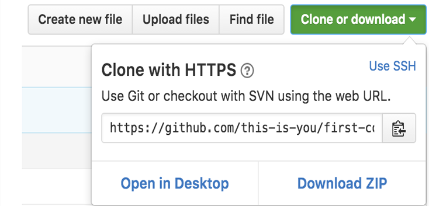
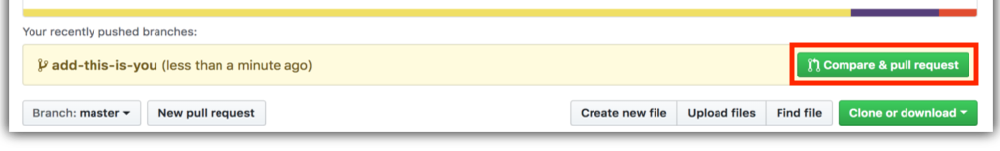
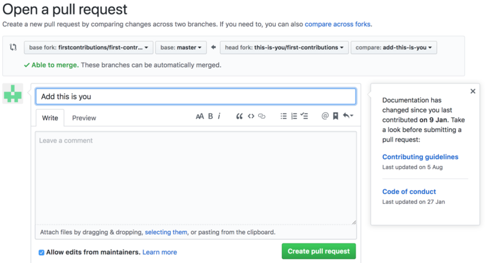

# ការចូលរួមដំបូង

វាពិបាកណាស់។ វាតែងតែពិបាកនៅពេលដំបូងដែលអ្នកធ្វើអ្វីមួយ។ ជាពិសេសនៅពេលដែលអ្នកកំពុងសហការគ្នា, ការបង្កើតកំហុសមិនមែនជារឿងដែលល្អនោះទេ។ យើងចង់ធ្វើឱ្យសាមញ្ញសម្រាប់វិធីក្នុងការសិក្សានិងចូលរួមជាលើកដំបូងរបស់អ្នករួមចំណែកបង្កើតប្រភពបើកចំហថ្មី។

អានអត្ថបទនិងការមើលការបង្រៀនអាចជួយបានប៉ុន្តែតើអ្វីដែលល្អប្រសើរជាងការអនុវត្តជាក់ស្ដែង? គម្រោងនេះមានគោលបំណងផ្តល់ការណែនាំនិងភាពងាយស្រួលក្នុងការចាប់ផ្តើមចូលរូមធ្វើការដំបូង។ ប្រសិនបើអ្នកកំពុងស្វែងរកការចូលរូមធ្វើការដំបូងសូមអនុវត្តតាមជំហានខាងក្រោម។

#### *ប្រសិនបើអ្នកមិនប្រសព្វក្នុងការប្រើបន្ទាត់ពាក្យបញ្ជា(command line), [នេះគឺការបង្រៀនដោយប្រើប្រាស់ឧបករណ៍ GUI.]( #tutorials-using-other-tools )*



ប្រសិនបើអ្នកមិនមាន git នៅលើម៉ាស៊ីនរបស់អ្នក, [ដំឡើងវា]( https://help.github.com/articles/set-up-git/).

## ទាញឃ្លាំងផ្ទុកទៅក្នុងគណនីរបស់អ្នក

ទាញឃ្លាំងនេះដោយចុចលើប៊ូតុង fork នៅផ្នែកខាងលើនៃទំព័រនេះ។
វានឹងបង្កើតច្បាប់ចម្លងនៃឃ្លាំងនេះនៅក្នុងគណនីរបស់អ្នក។

## ក្លូនឬថតចម្លងឃ្លាំងផ្ទុក


ឥឡូវនេះក្លូនឃ្លាំងផ្តុកដែលបានទាញទៅម៉ាស៊ីនរបស់អ្នក។ ចូលទៅកាន់គណនី GitHub របស់អ្នកបើកឃ្លាំងផ្ទុកដែលបានទាញរួចចុចលើប៊ូតុង clone ហើយបន្ទាប់មកចុចលើ ប៊ូតុង* copy to clipboard *។

បើក Git bash និងបញ្ចូលពាក្យបញ្ជា git ដូចខាងក្រោម:

```
git clone "អាសយដ្ធាន(url)ដែលបានចម្លង"
```
ដែល "អាសយដ្ធាន(url)ដែលបានចម្លង" (គ្មានសញ្ញា " ") គឺជាអាសយដ្ធាន(url)នៃឃ្លាំងផ្ទុក (កម្រោងដែលអ្នកបានទាញ).សូមមើលជំហានមុន ៗ ដើម្បីទទួលបានអាសយដ្ធាន(url).



ឧទាហរណ៏:
```
git clone https://github.com/Vireak-Sok/Github-beginner-tutorial.git
```
ដែល `this-is-you` គឺជាឈ្មោះប្រើ GitHub របស់អ្នក. នៅទីនេះអ្នកកំពុងចម្លងមាតិកានៃឃ្លាំង Github-beginner-tutorial នៅក្នុង GitHub ទៅកុំព្យូទ័ររបស់អ្នក.

## បង្កើតសាខា

ផ្លាស់ប្តូរទៅថតឃ្លាំងផ្ទុកនៅលើកុំព្យូទ័ររបស់អ្នក (ប្រសិនបើអ្នកមិនទាន់មាន):

```
cd first-contributions
```
ឥឡូវបង្កើតសាខាដោយប្រើពាក្យបញ្ជា `git checkout ':
```
git checkout -b <add-your-new-branch-name>
```

ឧទាហរណ៏:
```
git checkout -b add-alonzo-church
```
(ឈ្មោះសាខាមិនចាំបាច់មានពាក្យ *add* ទេប៉ុន្តែវាជារឿងសមល្មមក្នុងការបញ្ចូលដោយហេតុថាគោលបំណងនៃសាខានេះគឺដើម្បីបន្ថែមឈ្មោះរបស់អ្នកទៅបញ្ជី។)

## ធ្វើការផ្លាស់ប្តូរចាំបាច់និងធ្វើការផ្លាស់ប្តូរទាំងនោះ

ឥឡូវនេះបើកឯកសារ `contributors-list.md` នៅក្នុងកម្មវិធីកែឯកសារណាមួយ(ដូចជា Notepad)បន្ថែមឈ្មោះរបស់អ្នកទៅវា។ កុំបន្ថែមវានៅដើមឬចុងបញ្ចប់នៃឯកសារ។ ដាក់វានៅគ្រប់ទីកន្លែង។ ឥឡូវរក្សាទុកឯកសារ។


ប្រសិនបើអ្នកទៅកាន់ថតគម្រោងនិងបញ្ចូលពាក្យបញ្ជា `git status' អ្នកនឹងឃើញមានការផ្លាស់ប្តូរ។


បន្ថែមការផ្លាស់ប្ដូរទាំងនោះទៅកាន់សាខាដែលអ្នកទើបតែបានបង្កើតដោយប្រើពាក្យបញ្ជា `git add`:

```
git add Contributors.md
```

ឥឡូវនេះធ្វើការផ្លាស់ប្ដូរទាំងនោះដោយប្រើពាក្យបញ្ជា 'git commit':
```
git commit -m "Add <your-name> to Contributors list"
```
ជំនួស `<your-name>` ដោយឈ្មោះរបស់អ្នក.

## រុញ(push)ការផ្លាស់ប្តូរទៅ GitHub

រុញការផ្លាស់ប្តូររបស់អ្នកដោយប្រើពាក្យបញ្ជា `git push`:
```
git push origin <add-your-branch-name>
```
ជំនួស `<add-your-branch-name>` ដោយឈ្មោះរបស់សាខាដែលអ្នកបានបង្កើតមុននេះ។

## ដាក់ស្នើការផ្លាស់ប្តូររបស់អ្នកសម្រាប់ការពិនិត្យ

ប្រសិនបើអ្នកទៅកាន់ឃ្លាំងផ្ទុករបស់អ្នកនៅលើ GitHub អ្នកនឹងឃើញប៊ូតុង `Compare & pull request '។ ចុចលើប៊ូតុងនោះ។



ឥឡូវនេះដាក់ស្នើសំណើទាញ។



មិនយូរប៉ុន្មានខ្ញុំនឹងបញ្ចូលការផ្លាស់ប្ដូរទាំងអស់របស់អ្នកទៅក្នុងសាខាមេ(master branch)នៃគម្រោងនេះ។ អ្នកនឹងទទួលបានអ៊ីម៉ែលការជូនដំណឹងនៅពេលដែលការផ្លាស់ប្តូរត្រូវបានបញ្ចូលចូលគ្នា។

## តើត្រូវទៅទីណា?

អបអរសាទរ! អ្នកទើបតែបានបញ្ចប់គំរូ _fork -> clone -> edit -> PR_ ដំណើរការនៃការងារដែលអ្នកនឹងជួបប្រទះញឹកញាប់ក្នុងនាមជាអ្នករួមចំណែក!

សូមអបអរសាទរការរួមចំណែករបស់អ្នកនិងចែករំលែកវាជាមួយមិត្តភក្តិនិងអ្នកគាំទ្ររបស់អ្នកដោយចូលទៅ [អាសយដ្ធាន](https://firstcontributions.github.io/#social-share).
