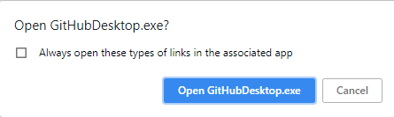
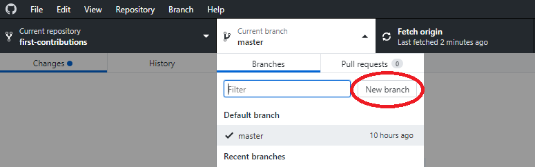
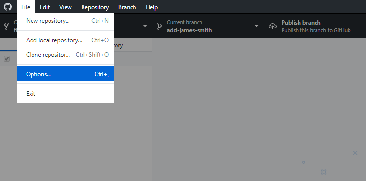

# ការចូលរួមដំបូង

||GitHub Desktop Edition|
|---|---|

ទាញយក GitHub Desktop លើម៉ាស៊ីនរបស់អ្នក, [ដំឡើងវា](https://desktop.github.com/).

ទាញយកកំណែចាស់របស់ GitHub Desktop 1.0, [យោងឯកសារបង្រៀននេះ](github-desktop-old-version-tutorial.md).

## ទាញឃ្លាំងផ្ទុកទៅក្នុងគណនីរបស់អ្នក

ទាញឃ្លាំងផ្ទុកនេះដោយចុចលើប៊ូតុង fork នៅផ្នែកខាងលើកំពូលនៃទំព័រនេះ។
នេះនឹងបង្កើតច្បាប់ចម្លងនៃឃ្លាំងផ្ទុកនេះនៅក្នុងគណនីរបស់អ្នក។

## ក្លូនឬថតចម្លងឃ្លាំងផ្ទុក

ឥឡូវនេះក្លូនឃ្លាំងផ្ទុកនេះទៅម៉ាស៊ីនរបស់អ្នក។

សំខាន់: កុំក្លូនលើសាខាដើម(master branch)។ ទៅកាន់ឃ្លាំងផ្ទុកដែលបានទាញរបស់អ្នកហើយក្លូនវា។

ដើម្បីក្លូនឃ្លាំងចុចលើ "Clone or Download" ហើយបន្ទាប់មកចុចលើ "Open in Desktop" ។

បង្អួចលេចឡើង(pop up window) នឹងបើក។ ចុចលើ "Open GitHubDesktop.exe" ។

បន្ទាប់ពីអ្នកចុចលើ "Open GitHubDesktop.exe" មាតិកានឹងត្រូវបានទាញយកទៅកុំព្យូទ័ររបស់អ្នក។

ឥឡូវអ្នកបានចម្លងមាតិកានៃឃ្លាំងផ្ទុកនេះនៅក្នុង github ទៅកុំព្យូទ័ររបស់អ្នក។

## បង្កើតសាខា

ឥឡូវបង្កើតសាខាមួយដោយចុចលើប៊ូតុង "Current branch" នៅខាងលើហើយបន្ទាប់មកចុចលើ "New branch":

ដាក់ឈ្មោះសាខារបស់អ្នក <add-your-name>. 

ឧទាហរណ៏, "add-john-doe"

ចុចលើ `Create branch`

## ធ្វើការផ្លាស់ប្តូរចាំបាច់និងធ្វើការផ្លាស់ប្តូរទាំងនោះ

ឥឡូវនេះបើកឯកសារ `contributors-list.md` នៅក្នុងកម្មវិធីកែឯកសារណាមួយ(ដូចជា Notepad) ហើយអូសទៅបាតនៃទំព័រហើយបន្ថែមឈ្មោះរបស់អ្នកទៅវាបន្ទាប់មករក្សាទុកឯកសារ។
ធ្វើការផ្លាស់ប្តូរតាមគំរូដែលបានផ្តល់ឱ្យក្នុងឯកសារដើមនោះ។

អ្នកអាចឃើញថាមានការផ្លាស់ប្តូរចំពោះ contributors-list.md ហើយវាត្រូវបានបន្ថែមទៅ Github Desktop ។

ឥឡូវនេះធ្វើការផ្លាស់ប្តូរទាំងនោះ:

សរសេរសារ "Add `<your-name>` to contributors-list" នៅក្នុង * សង្ខេប * ។

ជំនួស `<your-name>` ដោយឈ្មោះរបស់អ្នក.

សូមចុចលើប៊ូតុងដែលមានពាក្យថា "Commit to add-your-name" ។

នៅខាងក្រោមអ្នកអាចមើលឃើញថាការប្រព្រឹត្ត(commit)ត្រូវបានបង្កើត។

## រុញ(push)ការផ្លាស់ប្តូរទៅ GitHub

សូមចុចលើ File-> Options និង sign-in ទៅ Github.com ។ បញ្ចូលឈ្មោះប្រើនិងពាក្យសម្ងាត់ Github របស់អ្នក។

ចុចប៊ូតុង `Publish` នៅខាងស្ដាំផ្នែកខាងលើ។

## ដាក់ស្នើការផ្លាស់ប្តូររបស់អ្នកសម្រាប់ការពិនិត្យ

ប្រសិនបើអ្នកទៅកាន់ឃ្លាំងផ្ទុករបស់អ្នកនៅលើ GitHub អ្នកនឹងឃើញប៊ូតុង `Compare & pull request '។ ចុចលើប៊ូតុងនោះ។

ឥឡូវនេះដាក់ស្នើសំណើទាញ។

មិនយូរប៉ុន្មានខ្ញុំនឹងបញ្ចូលការផ្លាស់ប្ដូរទាំងអស់របស់អ្នកទៅក្នុងសាខាមេ(master branch)នៃគម្រោងនេះ។ អ្នកនឹងទទួលបានអ៊ីម៉ែលការជូនដំណឹងនៅពេលដែលការផ្លាស់ប្តូរត្រូវបានបញ្ចូលចូលគ្នា។

## តើត្រូវទៅទីណា?

អបអរសាទរ! អ្នកទើបតែបានបញ្ចប់គំរូ _fork -> clone -> edit -> PR_ ដំណើរការនៃការងារដែលអ្នកនឹងជួបប្រទះញឹកញាប់ក្នុងនាមជាអ្នករួមចំណែក!

សូមអបអរសាទរការរួមចំណែករបស់អ្នកនិងចែករំលែកវាជាមួយមិត្តភក្តិនិងអ្នកគាំទ្ររបស់អ្នកដោយចូលទៅ [អាសយដ្ធាន](https://firstcontributions.github.io/#social-share).
